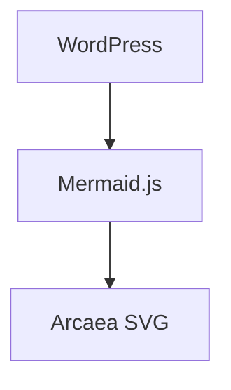

# Sakurairo Arcaea Blog Skill

## 目的

在 Sakurairo 主题的 WordPress 博客上应用 Arcaea 风格（玻璃拟态、深色卡片层级、冰蓝配色）的页面设计、美化和发布。一个文件包含完整工作流：CSS 设计体系、主题冲突覆盖、文章包装、批量样式统一和 WordPress 发布。

## 何时使用

- 用户要求在 Sakurairo 主题博客上"美化页面"、"应用 Arcaea 风格"、"设计 xx 页面"
- 需要创建带玻璃卡片层级的新页面（游戏/音乐展示风格）
- 需要保持跨页面一致的 Arcaea 视觉语言
- 出现 Sakurairo 主题 CSS 冲突（blockquote、FontAwesome 图标等）
- 需要将文章/页面发布到 WordPress

---

## 目录

- [前置技能加载](#前置技能加载必须)
- [CSS 设计体系](#css-设计体系)
- [Sakurairo 主题集成](#sakurairo-主题集成)
- [WordPress 发布工作流](#wordpress-发布工作流)
- [工作流](#工作流)
- [Pitfalls](#pitfalls)

---

## 前置技能加载（必须！）

此技能被触发时，必须先按顺序加载以下技能。**注意**：部分技能位于 `/root/.agents/skills/` 目录而非 Hermes 内置技能库，需通过 read_file 直接读取。

### 核心技能（可从 .agents/skills 加载）

1. **`sakurairo-theme`** — Sakurairo 主题功能完整指南：短代码、颜色系统、AI 摘要等
2. **`glassmorphism-ui`** — 毛玻璃 CSS 模式库
3. **`ui-beautify`** — Arcaea v5 精确 CSS 数值
4. **`ui-designer`** — 整页布局生成
5. **`css-master`** — 设计 Token 体系、Sakurairo 冲突诊断

### Hermes 内置技能

6. **`wordpress`** — WordPress REST API 操作

加载方式：

```
# .agents 技能用 read_file 直接读取
read_file(path="/root/.agents/skills/sakurairo-theme/SKILL.md")
read_file(path="/root/.agents/skills/sakurairo-arcaea-blog-skill/SKILL.md")

# Hermes 内置技能用 skill_view
skill_view(name="wordpress")
```

---

## CSS 设计体系

### 核心审美

Arcaea 的视觉气质是 **"遥远、冰冷、孤独"**——白色空间 + 碎裂玻璃、终末感天空 + 数字废墟、科幻感 UI + 电子音乐、抽象叙事 + 情绪片段。

博客风格 = 数字遗迹考古感。阅读是在废墟中拾取碎片。

其本质是一种 **"未来感 × 情绪化 × 极简秩序 × 崩坏诗意"**（Cyber Minimalism + Emotional Futurism）。

它与普通赛博朋克的区别：Arcaea 不追求"霓虹城市"，而是 **空旷、孤独、神圣感、几何秩序、数据碎片、光污染极少、高透明度、低饱和、情绪压抑与希望并存**。

### 文章包裹 CSS（Article Wrapper — v1.6.0 新增）

全站 43 篇文章统一 Arcaea 风格的精简 CSS 模板。与 Games/Music 页面的完整页面风格不同，文章包裹 CSS 专注于**阅读体验**：
- 代码块毛玻璃（FiraCode + blur(18px)），覆盖全部 `<pre>` 变体
- Blockquote 渐变底 + 冰蓝左边框（覆盖 Sakurairo FontAwesome）
- h2 底部细线分隔，h3 `#::before` 标记
- 表格暗玻璃卡片样式
- 行内 code 半透明蓝底 + 冰蓝文字色
- `prefers-reduced-motion` 暗模式适配

**完整 CSS 模板文件**：`references/article-wrapper-css.md`
**设计 Token 参考**：`references/visual-tokens.md`

**压缩版（直接用于文章）**：
```css
:root{--arcaea-bg:rgba(8,21,42,0.42);--arcaea-border:rgba(230,238,255,0.78);--arcaea-primary:rgba(238,244,255,0.96);--arcaea-accent:#9db4ff;--arcaea-text:rgba(238,244,255,0.94);--arcaea-muted:rgba(238,244,255,0.65);--arcaea-hash:rgba(255,130,130,0.55)}.arcaea-article-content{position:relative;z-index:1;color:var(--arcaea-text);max-width:100%}.arcaea-article-content h2{color:rgba(238,244,255,0.96);font-size:1.65em;font-weight:700;margin-top:2em;margin-bottom:0.6em;padding-bottom:0.3em;border-bottom:1px solid rgba(230,238,255,0.40);text-shadow:0 2px 10px rgba(0,0,0,0.45)}.arcaea-article-content h3{display:flex;align-items:center;gap:10px;color:rgba(238,244,255,0.96);font-size:1.35em;font-weight:700;margin-top:1.5em;margin-bottom:0.5em;text-shadow:0 2px 10px rgba(0,0,0,0.45)}.arcaea-article-content h3::before{content:"#";color:var(--arcaea-hash);font-size:0.9em;font-weight:700;flex-shrink:0}.arcaea-article-content h2::after,.arcaea-article-content h3::after{display:none!important}.arcaea-article-content p{line-height:1.8;margin:1em 0;color:rgba(238,244,255,0.94)}.arcaea-article-content pre,.arcaea-article-content pre.wp-block-preformatted,.arcaea-article-content pre.arcaea-code,.arcaea-article-content pre[class*="language-"]{font-family:"FiraCode Nerd Font","Fira Code",Consolas,monospace!important;font-size:15px;line-height:1.7;background:rgba(8,21,42,0.42)!important;color:rgba(238,244,255,0.94)!important;border:1px solid rgba(230,238,255,0.78);border-radius:10px;backdrop-filter:blur(12px) saturate(130%);-webkit-backdrop-filter:blur(12px) saturate(130%);box-shadow:0 12px 36px rgba(0,0,0,0.22),inset 0 1px 0 rgba(255,255,255,0.12);padding:1.35rem 1.5rem;margin:2rem 0;overflow:auto}.arcaea-article-content code{font-family:"FiraCode Nerd Font","Fira Code",Consolas,monospace!important;background:rgba(230,238,255,0.10);padding:0.2em 0.4em;border-radius:4px;font-size:0.9em;color:rgba(238,244,255,0.94)!important}.arcaea-article-content pre code{background:transparent;padding:0;border-radius:0;font-size:inherit;color:inherit!important}.arcaea-article-content blockquote{background:rgba(8,21,42,0.42)!important;border:1px solid rgba(230,238,255,0.78)!important;border-left:3px solid rgba(230,238,255,0.90)!important;border-radius:10px!important;padding:14px 20px!important;margin:14px 0!important;color:rgba(238,244,255,0.94)!important;box-shadow:0 12px 36px rgba(0,0,0,0.22),inset 0 1px 0 rgba(255,255,255,0.12)!important;backdrop-filter:blur(12px) saturate(130%);-webkit-backdrop-filter:blur(12px) saturate(130%)}.arcaea-article-content blockquote::before{display:none!important;content:none!important}.arcaea-article-content blockquote::after{display:none!important;content:none!important}.arcaea-article-content table{border-collapse:collapse;width:100%;margin:1.5em 0;background:rgba(8,21,42,0.42);border:1px solid rgba(230,238,255,0.78);border-radius:10px;overflow:hidden;backdrop-filter:blur(12px) saturate(130%);-webkit-backdrop-filter:blur(12px) saturate(130%);box-shadow:0 12px 36px rgba(0,0,0,0.22),inset 0 1px 0 rgba(255,255,255,0.12)}.arcaea-article-content th,.arcaea-article-content td{padding:10px 14px;border:1px solid rgba(230,238,255,0.20);text-align:left}.arcaea-article-content th{background:rgba(139,167,255,0.12);color:rgba(238,244,255,0.96);font-weight:600}.arcaea-article-content ul,.arcaea-article-content ol{padding-left:1.5em;margin:0.8em 0}.arcaea-article-content li{margin:0.4em 0;line-height:1.7;color:rgba(238,244,255,0.92);font-weight:600}.arcaea-article-content a{color:#8ad8ff;text-decoration:none;border-bottom:1px solid rgba(138,216,255,0.25);transition:border-color 0.2s}.arcaea-article-content a:hover{border-bottom-color:rgba(138,216,255,0.6)}.arcaea-article-content hr{border:none;height:1px;background:linear-gradient(90deg,transparent,rgba(230,238,255,0.30),transparent);margin:2em 0}.arcaea-article-content img{border-radius:10px;max-width:100%;height:auto}.arcaea-article-content figure{margin:1.5em 0}.arcaea-article-content figcaption{text-align:center;font-size:0.85em;color:var(--arcaea-muted);margin-top:0.5em}.arcaea-article-content .wp-block-heading{color:inherit}.arcaea-article-content .wp-block-paragraph{color:inherit}.arcaea-article-content .wp-block-table{overflow-x:auto}.arcaea-article-content .wp-block-group{background:rgba(8,21,42,0.42);border:1px solid rgba(230,238,255,0.78);border-radius:10px;padding:16px;margin:1.5em 0;backdrop-filter:blur(12px) saturate(130%);-webkit-backdrop-filter:blur(12px) saturate(130%);box-shadow:0 12px 36px rgba(0,0,0,0.22),inset 0 1px 0 rgba(255,255,255,0.12)}@media(prefers-reduced-motion:reduce){.arcaea-article-content *{animation:none!important;transition:none!important}}
```

### 配色体系

```css
/* 主色 — 冰蓝/冷白/淡紫 */
--c-primary: #dbe8ff;
--c-accent: #9db4ff;
--c-skyblue: #8ad8ff;
--c-violet: #c7b6ff;
--c-white: #ffffff;

/* 背景 — 深色太空 */
--bg-deep: #05070b;
--bg-mid: #0b1020;
--bg-surface: #111827;
--bg-dark: #09090f;
```

**禁止**：高纯度红、荧光绿、彩虹渐变、过亮蓝。

### 视觉层级体系

正确结构 = **"很多层轻重不同的小玻璃"**，而非一块巨型玻璃面板。

```
背景图（最底层）
  ↓
bg-overlay（压暗背景，fixed 定位）
  ↓
容器/分类（轻，透明度 ~0.42，仅分区）
  ↓
条目卡片（深，透明度 0.82，真正阅读区）
  ↓
强调块/引用（最实体，渐变底 + 左边框）
```

**核心规则**：每层视觉重量递增，透明度递减。

### 最终校准 CSS 值（v5.4 — Games + Music 统一）

```css
/* ===== 动态光晕（来自 Music 页） ===== */
.bg-glow-1 {
  position: fixed;
  width: 1000px; height: 1000px;
  top: -200px; right: -150px;
  background: radial-gradient(circle, rgba(120,180,255,0.08), transparent 70%);
  filter: blur(120px);
  pointer-events: none;
  z-index: 0;
  animation: floatGlow 20s ease-in-out infinite;
}
.bg-glow-2 {
  position: fixed;
  width: 800px; height: 800px;
  bottom: -150px; left: -100px;
  background: radial-gradient(circle, rgba(167,139,250,0.06), transparent 70%);
  filter: blur(100px);
  pointer-events: none;
  z-index: 0;
  animation: floatGlow 24s ease-in-out infinite reverse;
}
@keyframes floatGlow {
  0%   { transform: translate(0,0) scale(1); }
  50%  { transform: translate(50px,-30px) scale(1.06); }
  100% { transform: translate(0,0) scale(1); }
}

/* ===== 噪声纹理层（来自 Music 页） ===== */
.games-arcaea-wrap::before {
  content: "";
  position: fixed;
  inset: 0;
  background-image: url("data:image/svg+xml,%3Csvg viewBox='0 0 256 256' xmlns='http://www.w3.org/2000/svg'%3E%3Cfilter id='n'%3E%3CfeTurbulence type='fractalNoise' baseFrequency='0.85' numOctaves='4' stitchTiles='stitch'/%3E%3C/filter%3E%3Crect width='100%25' height='100%25' filter='url(%23n)' opacity='0.04'/%3E%3C/svg%3E");
  opacity: 0.4;
  pointer-events: none;
  z-index: -2;
}

/* ===== 背景遮罩层 ===== */
.games-arcaea-wrap .bg-overlay {
  position: fixed;
  inset: 0;
  background: rgba(0, 0, 0, 0.62);
  backdrop-filter: blur(20px) brightness(0.68) saturate(60%);
  -webkit-backdrop-filter: blur(20px) brightness(0.68) saturate(60%);
  z-index: 0;
  pointer-events: none;
}

/* ===== 全局覆盖 ===== */
:root {
  --theme-skin: #0a0e18;
  --theme-skin-dark: #05070d;
  --global-font-weight: 300;
}

/* ===== 动态光晕 ===== */
.bg-glow-1{position:fixed;width:1000px;height:1000px;top:-200px;right:-150px;background:radial-gradient(circle,rgba(120,180,255,0.08),transparent 70%);filter:blur(120px);pointer-events:none;z-index:0;animation:floatGlow 20s ease-in-out infinite}
.bg-glow-2{position:fixed;width:800px;height:800px;bottom:-150px;left:-100px;background:radial-gradient(circle,rgba(167,139,250,0.06),transparent 70%);filter:blur(100px);pointer-events:none;z-index:0;animation:floatGlow 24s ease-in-out infinite reverse}

/* ===== 内容容器 ===== */
.games-arcaea-wrap {
  position: relative;
  z-index: 1;
  max-width: 100%;
  color: #f7fbff;
  overflow-x: hidden;
}

/* ===== HERO（v5.4: 禁用 sticky 防止内容挤占）===== */
.games-arcaea-wrap .game-hero{padding:120px 0 80px;display:flex;align-items:flex-start;justify-content:space-between;min-height:70vh;max-width:1380px;margin:0 auto;padding-left:clamp(24px,6vw,90px);padding-right:clamp(24px,6vw,90px);gap:clamp(24px,5vw,60px)}
.hero-left{flex:1 1 auto;max-width:620px;min-width:0}
.hero-title{font-size:clamp(48px,8vw,100px);font-weight:700;letter-spacing:-0.04em;line-height:1.05;background:linear-gradient(90deg,#9ecfff,#8ba7ff,#a78bfa);-webkit-background-clip:text;-webkit-text-fill-color:transparent;background-clip:text;margin:0}
.hero-right{flex:0 0 auto;min-width:180px;text-align:right;padding-top:60px}
.floating-tag{display:block;font-size:clamp(13px,1.4vw,20px);font-weight:300;color:rgba(255,255,255,0.18);letter-spacing:0.08em;line-height:2.3;transition:color 0.4s ease;cursor:default}

/* ===== 分类容器（轻）===== */
.game-category {
  background: rgba(10, 14, 24, 0.42);
  border: 1px solid rgba(255, 255, 255, 0.06);
  border-radius: 18px;
  padding: 16px 20px;
  margin: 32px 0;
  backdrop-filter: blur(10px);
  -webkit-backdrop-filter: blur(10px);
  box-shadow: none;
}

/* ===== 条目卡片（重）===== */
.game-entry {
  background: rgba(8, 12, 20, 0.82);
  border-radius: 18px;
  padding: 20px 24px;
  margin: 16px 0;
  border: 1px solid rgba(160, 220, 255, 0.16);
  box-shadow:
    0 8px 32px rgba(0,0,0,0.32),
    inset 0 0 0 1px rgba(255,255,255,0.06);
  transition: border-color 0.3s ease, box-shadow 0.3s ease;
  backdrop-filter: blur(8px);
  -webkit-backdrop-filter: blur(8px);
}
.game-entry:hover {
  border-color: rgba(160,220,255,0.30);
  box-shadow: 0 6px 28px rgba(0,0,0,0.40);
}

/* ===== 色调变体（按分类，类似 Music 页 artist-card--{artist}） ===== */
.game-entry--core {
  background: linear-gradient(145deg, rgba(139,167,255,0.10), rgba(219,234,254,0.04));
  border-color: rgba(139,167,255,0.18);
}
.game-entry--rhythm {
  background: linear-gradient(145deg, rgba(177,140,255,0.10), rgba(199,160,255,0.04));
  border-color: rgba(177,140,255,0.18);
}
.game-entry--narrative {
  background: linear-gradient(145deg, rgba(100,140,255,0.08), rgba(80,120,230,0.03));
  border-color: rgba(100,140,255,0.16);
}
.game-entry--exploration {
  background: linear-gradient(145deg, rgba(120,210,255,0.08), rgba(160,230,255,0.03));
  border-color: rgba(120,210,255,0.16);
}
.game-entry--engineering {
  background: linear-gradient(145deg, rgba(150,160,180,0.07), rgba(130,140,160,0.03));
  border-color: rgba(150,160,180,0.14);
}
.game-entry--flight {
  background: linear-gradient(145deg, rgba(255,160,80,0.07), rgba(255,180,100,0.03));
  border-color: rgba(255,160,80,0.14);
}
.game-entry--darkfantasy {
  background: linear-gradient(145deg, rgba(255,80,100,0.07), rgba(200,60,80,0.03));
  border-color: rgba(255,80,100,0.14);
}

/* ===== 分类标题 ===== */
.game-category > h2 {
  color: #f3f0ff;
  font-size: 1.75em;
  font-weight: 700;
  letter-spacing: 0.04em;
  margin: 0 0 8px 0;
  text-shadow:
    0 0 10px rgba(180,150,255,0.55),
    0 2px 4px rgba(0,0,0,0.75);
}

/* ===== 卡片标题 ===== */
.game-entry h3 {
  display: flex;
  align-items: center;
  gap: 10px;
  color: #e2f4ff;
  font-size: 1.35em;
  font-weight: 700;
  margin: 0 0 6px 0;
  text-shadow:
    0 0 12px rgba(126,200,255,0.45),
    0 2px 4px rgba(0,0,0,0.75);
}
.game-entry h3::before {
  content: "#";
  color: rgba(255,145,145,0.75);
  font-size: 0.95em;
  font-weight: 700;
  flex-shrink: 0;
}
```


### Section 通用布局

```
.section-kicker — 细微分类标签 (uppercase, violet-tinted)
.section-title  — H2 标题 (text-shadow 紫辉)
.section-desc   — 段落描述 (淡蓝灰)
```

### Blockquote 设计（Sakurairo 覆盖 — 必须 !important）

```css
.games-arcaea-wrap blockquote {
  background: linear-gradient(135deg, rgba(40,70,120,0.22), rgba(20,30,50,0.14)) !important;
  border-left: 3px solid rgba(126,200,255,0.55) !important;
  border-radius: 12px !important;
  padding: 14px 20px !important;
  margin: 14px 0 !important;
  color: #f8fbff !important;
  font-size: 1.06em !important;
  line-height: 1.85 !important;
  box-shadow: none !important;
  border-right: none !important;
  border-top: none !important;
  border-bottom: none !important;
}
.games-arcaea-wrap blockquote::before,
.games-arcaea-wrap blockquote::after {
  display: none !important;
  content: none !important;
}
.games-arcaea-wrap blockquote p {
  margin: 0 !important;
  padding: 0 !important;
  padding-left: 0 !important;
  border: none !important;
  background: none !important;
}
```

### 标题 `#` 标记

绝对禁止在 HTML 中写独立 `#` 文本节点。正确做法：

```css
.game-entry h3 { display: flex; align-items: center; gap: 10px; }
.game-entry h3::before { content: "#"; color: rgba(255,145,145,0.75); font-size: 0.95em; font-weight: 700; flex-shrink: 0; }
```

### Music 页面专属组件

详见 [`references/mood-spectrum-css.md`](references/mood-spectrum-css.md) 和下方 CSS。

```css
/* Artist Grid */
.artist-grid{display:grid;grid-template-columns:repeat(3,minmax(0,1fr));gap:22px;margin:24px 0}
.artist-card{...background:rgba(8,12,20,0.82);border:1px solid rgba(160,220,255,0.16);...}
.artist-card h3::before{content:"#";color:rgba(255,145,145,0.75)}

/* Album Wall */
.album-wall{display:grid;grid-template-columns:repeat(auto-fill,minmax(132px,1fr));gap:15px}

/* Resonance */
.resonance-line{padding-left:24px;border-left:none}
.resonance-line::before{content:">";position:absolute;left:0;color:rgba(157,180,255,0.62)}
.resonance-quote{margin:26px 0;padding:16px 0 16px 24px;border-left:3px solid rgba(126,200,255,0.48);border-radius:0 12px 12px 0}
```

### Mood Spectrum（情绪标签）

关键见 [`references/mood-spectrum-css.md`](references/mood-spectrum-css.md)。核心要点：
- `flex-shrink: 0` 防止标签被压缩
- `display: inline-flex` 使内容垂直居中
- `gap: 10px 12px`（行距10px + 列距12px）
- **修补前检查是否已有前缀**，避免 `.games-arcaea-wrap .games-arcaea-wrap` 双重污染

### Arcaea Lite（Hub 页面 / 博客文章轻量包裹）

见 [`references/arcaea-lite-wrapper.md`](references/arcaea-lite-wrapper.md)。用于关于、工具箱、嵌入式专题、游记、**博客文章**等非内容密集型页面。带 `bg-glow` 光晕氛围但**无 bg-overlay 模糊层**（避免覆盖正文可读性）。

## Sakurairo 主题集成

### CSS 变量覆盖

Sakurairo 主题的颜色 CSS 变量可通过主题选项的自定义 CSS 覆盖：

```css
:root {
  --theme-skin: #0a0e18;              /* 覆盖主题主色为深色底 */
  --theme-skin-dark: #05070d;          /* 暗色模式更深 */
  --global-font-weight: 300;           /* 细体，符合 Arcaea 空灵感 */
}
```

部署方法：在 Sakurairo 主题选项 → 全局设置 → 自定义样式中添加上述 CSS。检查方法：查看首页 HTML 中 `--theme-skin` 的值。

### 自定义 CSS 注入路径

Sakurairo 支持两处自定义 CSS 注入：
- **主题选项 → 全局设置 → 自定义样式** — 注入 `<head>`，持久稳定（放 Prism/字体等全局样式）
- **页面/文章中的 `<style>` 块** — 作用域仅限于该页面（放 Arcaea 玻璃卡片等页面独有样式）

### 已知冲突（Sakurairo v3.0.10 默认）

```css
/* 主题默认（必须用 !important 覆盖） */
blockquote { padding: 20px 30px !important; }
blockquote:before { content: "\f10d" !important; }  /* FontAwesome 图标 */
blockquote:after  { content: "\f10e" !important; }
blockquote p { padding-left: 10px; }
```

### 主题 REST API 端点

| 端点 | 用途 |
|------|------|
| `GET /wp-json/sakura/v1/chatgpt?post_id={ID}` | 生成 AI 摘要 |
| `GET /wp-json/sakura/v1/archive_info` | 归档统计信息 |
| `GET /wp-json/sakura/v1/qqinfo` | QQ 用户信息 |

---

## WordPress 发布工作流

### 基础设施

- **站点**: 你的 WordPress 站点 URL
- **主题**: Sakurairo（推荐 v3.0.10+）
- **MCP 服务器**: `~/.hermes/scripts/wp_mcp_server.py`（确保进程运行中）
- **凭证**: 不在此文件中记录。MCP 脚本从环境变量或自身源码读取

### 可用 MCP 工具

1. `GET /wp-json/wp/v2/pages/{id}?context=edit` 获取 `content.raw`（原始 HTML，未被 wpautop 污染）
2. 在 Python 中修改 `raw` 内容（精确字符串匹配）
3. `POST /wp-json/wp/v2/pages/{id}` 传回 `{"content": modified_raw}`
4. 用 `curl -sL URL | grep` 验证关键 CSS 选择器存在

**注意：MCP 工具没有 delete 操作。** 需要删除文章时，通过 Python REST API 的 `method="DELETE"` 移入回收站：

```python
req = urllib.request.Request(f"{SITE}/wp-json/wp/v2/posts/{post_id}",
    method="DELETE", headers=HEADERS)
```

### 规则：Python REST API 优先，绝对禁止 curl 带密码

**永远不要**在命令行使用 `curl -u "user:pass"` 形式访问 WordPress REST API。凭证会被 shell history 和进程列表捕获。

正确做法：

1. **Python + urllib + Application Password**（当前唯一可行路径）— 凭证不落磁盘，不暴露于 shell history。使用 `execute_code` 运行。完整脚本模式见 [`references/publishing-python-pattern.md`](references/publishing-python-pattern.md)。
2. **手动粘贴** — 将生成的 HTML 提供给用户，通过 WordPress 后台 Text 模式粘贴（安全且可靠的回退方案）。
3. **MCP 工具** — 当前仅有 WPForms 能力，无法直接发布/更新文章和页面。

MCP Adapter 配置查看：`hermes mcp list`，重载：`/reload-mcp`。

### 发布 Posts（新文章）流程

1. 列出已有文章避免重复：`GET /wp-json/wp/v2/posts?per_page=100&_fields=id,title,slug`
2. 列出分类和标签，确认分类 ID：`GET /wp-json/wp/v2/categories`、`GET /wp-json/wp/v2/tags`
3. 构建文章的 HTML 内容（含 `<style>` Arcaea Lite 包裹层）
4. `POST /wp-json/wp/v2/posts` 传参 `{title, slug, content, categories[], tags[], status="publish", excerpt}`
5. 额外加 `excerpt` 字段用于文章摘要

### 发布 Pages（更新已有页面）流程

1. `GET /wp-json/wp/v2/pages/{id}?context=edit` 获取 `content.raw`（未被 wpautop 污染的原始 HTML）
2. 在 Python 中修改 `raw` 内容（精确字符串匹配或替换）
3. `POST /wp-json/wp/v2/pages/{id}` 传回 `{"content": modified_raw}`
4. 用 `curl -sL URL | grep` 验证关键 CSS 选择器存在

### 发布后的验证

发布后必须验证：
1. REST API 返回 `status: publish`
2. 页面 HTTP 200 可访问
3. CSS style 块未被 wpautop 破坏（检查页面源码中 `<style>` 标签完整性，用 Python `urllib` 或 `curl` 实现，均**不携带密码**）
4. `<pre>` 代码块在渲染后的页面中可见（通过 grep 确认）
5. `arcaea-wrap` 类名存在于渲染后的 HTML 中（确认 Arcaea 样式正确加载）

---

## 工作流

### 0. 内容审查（写新内容前必须先做）

**永远不要跳过这一步。** 列出已有文章以发现空白，避免重复。

```python
# 列出所有 posts 和 pages
req = urllib.request.Request(f"{site}/wp-json/wp/v2/posts?per_page=100&_fields=id,title,slug", headers=headers)
req2 = urllib.request.Request(f"{site}/wp-json/wp/v2/pages?per_page=50&_fields=id,title,slug", headers=headers)
```

检查输出，确认没有已存在相似内容的文章/页面后再动笔。

### 1. 写新博客文章

a. 完成步骤 0 的空缺分析
b. 加载前置技能和 Arcaea Lite 包裹层 CSS
c. 撰写文章 HTML：`<style>Arcaea Lite CSS</style>` + `<div class="arcaea-wrap"><div class="bg-glow-1">...</div><div class="bg-glow-2">...</div>`
d. 使用 Python + urllib + Application Password 发布到 `POST /wp-json/wp/v2/posts`
   - 必须传参: `title`, `slug`, `content`, `categories[]`, `status="publish"`
   - 可选: `excerpt`, `tags[]`
   - slug 用英文 kebab-case
   - excerpt 写 50-120 字的中文摘要
e. 验证: HTTP 200 + 文章可访问 + `<style>` 未被 wpautop 破坏 + `<pre>` 代码块可见 + `arcaea-wrap` 类名存在

### 2. 设计新页面

a. 加载前置技能
b. 使用三层背景结构 + Hero + 卡片网格模式作为起始骨架
c. 使用 v5.4 精确 CSS 数值应用 Arcaea 层级
d. 添加 Sakurairo 主题 `!important` 覆盖
e. 通过 Python REST API 或手动粘贴发布

### 3. 美化已有页面 → 应用 Arcaea 风格

a. 分析当前页面 CSS 结构
b. 统一 wrapper 类名为 `.games-arcaea-wrap`
c. 统一 overlay 类名为 `.bg-overlay`
d. 按优先级修复：
   - **P0**: 统一类名体系（`.page-music` → `.games-arcaea-wrap`）
   - **P1**: `#` 独立文本 → `h3::before`
   - **P2**: 删除右下引号（blockquote ::before/::after → display:none）
   - **P3**: 卡片背景压暗 + 标题 text-shadow
   - **P4**: 正文加亮
   - **P5**: hero-right 禁用 sticky（防止内容挤占）

### 4. 修复 CSS 冲突

a. 对冲突选择器用 `!important` 覆盖
b. `blockquote::before` 和 `blockquote::after` 需同时设置 `display: none !important` 和 `content: none !important`
c. wpautop 会在 CSS 中插入 `<p>` 标签——使用紧凑单行 CSS 避免空行

### 5. 全站文章批量统一样式（v1.6.0 新增）

需求：「所有文章统一 Arcaea 风格」。

a. 准备统一 CSS 模板（见 `references/article-wrapper-css.md` 的压缩版）
b. 遍历所有文章，对每篇内容执行：
   - 移除已存在的 `<style>` 块（替换为统一模板）
   - 移除嵌入的完整 HTML 文档（`<!DOCTYPE>`、`<html>`、`<head>`、`<body>`）
   - 移除 hash-in-text（`<p># ` 等——改用 h3::before）
   - 添加 `<style>` 块 + `<div class="arcaea-article-content">` 包裹
c. 通过 WordPress REST API 批量更新
d. 验证：随机抽检 3-5 篇文章，确认样式块、包裹层、blockquote 覆盖完整

**批量更新脚本**见 `references/article-wrapper-css.md` 全站批量应用脚本部分。

**特殊处理**：
- 如果文章有英文正文 → 翻译为中文后再包裹
- 如果文章有杂乱内联样式（如嵌入的完整 HTML 文档）→ 剥离后再包裹
- CSS 被 wpautop 插入 `<p>` 不影响浏览器渲染，可忽略

### 6. 文章视觉一致性诊断（v1.7.2 新增）

当用户反馈两篇文章「看起来不一样」或「样式不统一」时，按以下 4 个维度逐项对比：

| 维度 | 检查项 | 诊断方法 |
|------|--------|---------|
| **卡片透明度/背景** | 卡片是否发灰或被遮罩压暗？边框是亮白还是灰蓝？ | 对比两篇文章的 `.arcaea-article-content` 子元素背景色、边框色、`backdrop-filter` 值 |
| **标题装饰** | 是否有异常的胶囊底纹或标签？h2/h3 的 `::after` 是否被主题注入？ | 检查 h2/h3 的 `::after` 伪元素；对比 border-bottom / text-shadow |
| **字体权重与对比度** | 正文文字是否偏灰偏淡？列表项是否加粗？ | 对比 `color`、`font-weight`、`opacity` 值；特别检查 `<li>` |
| **背景遮罩强度** | 整体是否「雾蒙蒙」？背景色调是否有差异（暗红 vs 蓝灰）？ | 对比 `background` 和 `backdrop-filter` 值 |

修复方向：统一为 `rgba(8,21,42,0.42)` 深蓝半透明底 + `rgba(230,238,255,0.78)` 亮白细边 + `rgba(238,244,255,0.94)` 高对比文字 + `backdrop-filter: blur(12px) saturate(130%)` + `inset 0 1px 0 rgba(255,255,255,0.12)` 白色内嵌高光。

所有设计 Token 值见 `references/visual-tokens.md`。

### 7. 内容语言规则（v1.7.0 新增）

**全站仅使用中文**。禁止出现全英文文章。
- 新文章直接以中文撰写
- 遗留英文文章须翻译为中文后再发布
- 代码块中的英文注释、标识符、技术术语保持原样
- 正文中的英文术语（API、I2C、MCU 等）保留，无需翻译

### 8. 批量注入 Mermaid 图（v1.7.2 新增）

当需要为大量技术文章批量添加 Mermaid 架构图/状态图/时序图时：

a. 按文章主题分组：架构分层→flowchart TB、状态机→stateDiagram-v2、协议通信→sequenceDiagram
b. 每个图用 Mermaid `theme: "base"` 语法，节点加 `style`（填 `fill:transparent,stroke:#8dc7ff,color:#eaf4ff` 适配深色毛玻璃背景）
c. 插入位置：第一个 `</p>` 之后（引言段落后），第一个 `<h2>` 之前
d. 注入前检查 `mermaid` 字符串是否已存在（避免二次注入）
e. 通过 WordPress REST API 批量 POST 更新
f. 验证：所有目标文章含 `mermaid` 字符串

详细注入模式见 [`references/mermaid-injection-pattern.md`](references/mermaid-injection-pattern.md)。

---

## Pitfalls

### 1. wpautop 污染 `<style>` 标签
WordPress 的 wpautop 会在 `<style>` 块内的每个换行处插入 `<p>` 标签。**解决方案**：CSS 规则写成紧凑单行，规则之间不留空行。虽然浏览器仍能解析，但会臃肿且丑陋。

### 2. hero-right sticky 造成内容挤占
旧版使用 `position: sticky; top: 25vh` 让右侧标签浮动跟随滚动，导致滚动时漂浮标签压入下方内容区。**v5.4 修复**：移除此属性，改回普通 flex 布局。

### 3. Music 页面类名不一致
历史版本中 Music 页面使用 `.page-music` / `.bg-overlay-music` / `.music-hero` 等独立类名，与 Games 页面的 `.games-arcaea-wrap` / `.bg-overlay` / `.game-hero` 完全不同。**v5.4 统一**：所有页面使用相同的 `.games-arcaea-wrap` 体系。

### 4. Python 直接 REST API 发布路径（MCP 不可用时的正确做法）
MCP Adapter 当前仅有 WPForms 能力，无法发帖。wp_mcp_server.py 不存在。使用 Python `urllib` + Application Password 直接调 REST API 发布/更新文章和页面，详见 [`references/publishing-python-pattern.md`](references/publishing-python-pattern.md)。**不要在发布路径上死磕 MCP。**

### 5. Sakurairo 暗黑模式覆盖
Sakurairo 暗黑模式通过 `[theme-mode="dark"]` 选择器覆盖颜色，Arcaea 深色方案可能被覆盖。需在页面 CSS 中添加 `!important` 防御。

### 6. backdrop-filter 性能
不超过 3 层 blur，否则滚动卡顿。本设计仅使用 2 层（bg-overlay + game-category），安全。

### 7. alpha < 0.04 的边框在深色背景上不可见
在 `#05070d` 基底上最小可用 alpha 为 0.06。

### 8. CSS 注释污染 meta
CSS 注释中的文字可能被 WordPress 提取到 `<meta description>`。保持注释简洁。

### 9. 外部技能加载路径
本技能引用的 `sakurairo-theme`、`glassmorphism-ui` 等技能位于 `/root/.agents/skills/`，**不在 Hermes 内置技能库中**。使用 `read_file` 直接读取，而非 `skill_view`。

### 10. 双重前缀陷阱
对已有 `.games-arcaea-wrap .mood-*` 选择器再次追加前缀，会变成 `.games-arcaea-wrap .games-arcaea-wrap .mood-*`，匹配不到任何元素（页面只有一层 wrap），CSS 完全失效。**修补已有选择器前，先用 regex 检查是否已含目标前缀。**

### 11. Mermaid ESM 本地化需完整 chunk 文件

`mermaid.esm.min.mjs` 是 ESM 动态导入仓包，内部 `import("./chunks/mermaid.esm.min/chunk-XXXX.mjs")` 加载 15+ 个 chunk。仅下载主文件会导致运行时所有 chunk URL 404。必须保留完整目录结构 `chunks/mermaid.esm.min/*.mjs`。CI 自动下载通过 jsDelivr API 获取 chunk 文件列表。

### 12. 插件自动更新三要素（v1.8+）

GitHub Release zip 必须满足：1) 内部目录名匹配插件 slug（不带版本号，如 `babel-arcaea-code/`）；2) 包含 `lib/` 目录（PUC 库本身，否则更新后 PUC 丢失后续无法检查更新）；3) `enableReleaseAssets()` 开启 zip 附件检测。推荐 `setAuthentication(GH_TOKEN)` 提 API 限速 60→5000 req/h。

### 11. 博客列表页的模板覆盖
Sakurairo 中某些分类列表页面（如「架构与重构」「工程复盘」）使用 post-loop 模板，**页面内容被完全忽略**，直接显示文章列表。这类页面的 Arcaea 样式无法通过 page content 注入，必须通过**主题选项 → 自定义样式**全局注入 CSS 覆盖。

### 12. `context=edit` 获取原始内容
更新页面时使用 `?context=edit` 获取 `content.raw`（wpautop 之前的原始内容），而非默认的 `content.rendered`（已被 wpautop 污染）。`raw` 中的 HTML 结构精确可匹配，`rendered` 中被插入了不可预测的 `<p>` 标签。

### 14. `<pre>` 标签在 WordPress REST API 中可正常保存

WordPress REST API 完整保留 `<pre>` 标签，不会被 kses 过滤或 wpautop 破坏。**不要用 Markdown 代码 fence 代替 `<pre>`** — WordPress 不做 Markdown 到 HTML 的转换。博文中的代码块必须始终使用 `<pre>` 标签，验证方法：发布后 fetch 页面源码并 grep `<pre>`。

### 16. 代码块 CSS 选择器必须覆盖所有 `<pre>` 变体（v1.7.1 新增）

WordPress 文章中的代码块有多种 `<pre>` 标签形式，每种都需要 CSS 覆盖：

| 标签形式 | 来源 | 选择器 |
|---------|------|--------|
| `<pre>` | 纯文本 / 手动输入 | `.arcaea-article-content pre` |
| `<pre class="wp-block-preformatted">` | Gutenberg「预格式化」块 | `.arcaea-article-content pre.wp-block-preformatted` |
| `<pre class="arcaea-code">` | 旧版 Arcaea 文章遗留类 | `.arcaea-article-content pre.arcaea-code` |
| `<pre class="language-xxx">` | Prism.js 语法高亮 | `.arcaea-article-content pre[class*="language-"]` |

**必须同时覆盖全部四种**，否则遗漏的选择器会使用主题默认样式（白色背景 + 黑色文字），导致深色背景上出现白色方块或黑字看不清。正确的 CSS：

```css
.arcaea-article-content pre,
.arcaea-article-content pre.wp-block-preformatted,
.arcaea-article-content pre.arcaea-code,
.arcaea-article-content pre[class*="language-"] {
  background: rgba(15,18,22,0.72) !important;
  color: #f0f6ff !important;   /* 必须显式设文字颜色 */
  ...
}
```

**`<code>` 标签同样需要显式设置颜色**：
- 行内 `<code>`：`.arcaea-article-content code { color: #f0f6ff !important; }`
- `<pre>` 内的 `<code>`：`.arcaea-article-content pre code { color: inherit !important; }`（继承 pre 的颜色，避免 Prism 默认黑色）

发布博文时始终提供 `excerpt` 字段（50-120 字），不要留空。摘要用于分类页和社交分享预览，留空时 WordPress 自动截取正文前几行，效果不可控。
使用 Python `urllib` + Application Password 直接调用 WordPress REST API 发布Posts和更新Pages。**不是回退方案，是标准方法。** 适用于 MCP 仅有 WPForms 能力、wp_mcp_server.py 不存在的环境。
```python
token = base64.b64encode(b"user:app-password").decode()
headers = {"Authorization": f"Basic {token}", "Content-Type": "application/json"}
data = json.dumps({"title":"T","content":html,"categories":[13],"status":"publish"}).encode()
req = urllib.request.Request("https://site/wp-json/wp/v2/posts", data=data, headers=headers, method="POST")
```
| 详见 [`references/publishing-python-pattern.md`](references/publishing-python-pattern.md)。**绝对禁止** `curl -u` 传密码（会泄露到 shell history）。

---

## Mermaid 图表渲染 + 代码高亮

**使用 [Babel Arcaea Code](https://github.com/AKCX2002/babel-arcaea-code)** 统一插件——本地化全部前端依赖，无 CDN。替代旧 `babel-arcaea-mermaid`。

### 根本教训：Prism/Mermaid 冲突无法在 JS 层解决

JS DOM 方案均告失败。Prism autoloader 的 `setTimeout` 回调持有已被替换的 `<pre>` 元素引用，`MutationObserver`/`head inline script`/`Prism.highlightElement patch` 均无法可靠阻止。

**唯一可靠方案：PHP `the_content` filter 在服务端替换。** 用 `preg_replace_callback` 将 `<pre><code class="language-mermaid">` 替换为 `<div class="mermaid">`。页面源码中永不出 `language-mermaid`，Prism 永远看不到。

详细调试历程见 [`references/prism-mermaid-conflict.md`](references/prism-mermaid-conflict.md)。

### 插件

https://github.com/AKCX2002/babel-arcaea-code

**详细技能文档**（插件架构/代码/Pitfalls）：skill_view(name='babel-arcaea-code') → 含 PHP filter 核心代码、Prism Arcaea Dark 主题 CSS、行号/溢出修复、esc_html() 关键坑、CI 每日自动更新、LightGallery/APlayer 抑制

安装：

```bash
cd /var/www/html/wp-content/plugins/
git clone https://github.com/AKCX2002/babel-arcaea-code.git
```

后台 → 插件 → 启用 → 设置 → Arcaea Code → 开「禁用 Sakurairo Prism」。

### 统一架构

```
Babel Arcaea Code
├── PHP the_content filter (priority 1): 替换 language-mermaid 代码块
├── Prism.js 1.30.0 (本地)
│   ├── 核心 + toolbar + show-language + line-numbers + line-highlight + match-braces + normalize-whitespace + command-line + treeview + previewers + copy + autoloader
│   ├── 20种语言组件 (c cpp python bash rust go dart ts js php ...)
│   └── Previewers Arcaea Glass Layer (prism-previewers-arcaea.css)
├── Mermaid 11.15.0 (本地 ESM + 全部 chunk 文件)
├── MathJax 3.2.2 (本地 tex-chtml.js)
├── medium-zoom 1.1.0 (本地, 图片点击放大)
├── PUC 自动更新 + CI 每日自动同步 3 个依赖
│   ├── Mermaid: GitHub Releases → 下载主文件 + 全部 chunk
│   ├── Prism.js: npm registry → 下载核心 + 插件 + 语言
│   └── MathJax: npm registry → 下载 tex-chtml.js
└── Sakurairo 兼容
    ├── 禁用主题自带 Prism (可配置)
    ├── 抑制 LightGallery license 警告
    └── APlayer 空容器跳过初始化
```

### 文章写法

````markdown

````

或短代码：

```
[mermaid]
flowchart TD
    A[启动] --> B[渲染]
[/mermaid]
```

### 工作流：文章里插入 Mermaid 图表

当需要在技术文章中插入状态图、流程图、分层架构图时：

a. 确认插件已启用（后台 → 设置 → Arcaea Mermaid）
b. 在文章编辑器中用 ```` ```mermaid ```` 或 `[mermaid]` 短代码写图
c. 发布后自动渲染为 Arcaea 风格 SVG（夜空背景 + 冰蓝连线 + 毛玻璃容器）
d. 主题跟随页面：Arcaea Dark（默认）/ Arcaea Light / Auto

### 推荐图表类型

| 图表类型 | 适用场景 |
|---------|---------|
| `flowchart` | 协议流程、系统架构、分层图 |
| `stateDiagram-v2` | FreeRTOS 状态机、设备状态迁移 |
| `sequenceDiagram` | 多任务时序、HMI-MCU 通信 |
| `gantt` | 项目排期、固件发版计划 |
| `graph` | 网络拓扑、依赖关系 |

### Arcaea 主题变量（Mermaid theme: "base"）

| 变量 | Arcaea Dark | Arcaea Light |
|------|------------|-------------|
| primaryColor | `#202a40` 深空蓝 | `#f6fbff` 浅蓝白 |
| primaryTextColor | `#f2f8ff` 亮白 | `#243246` 深蓝灰 |
| lineColor | `#9fd2ff` 冰蓝 | `#3d8fd9` |
| textColor | `#f2f8ff` | `#243246` |
| nodeBorder | `#9fd2ff` | `#5ba8f5` |
| fontFamily | FiraCode Nerd Font | 同左 |

### Pitfalls

1. **Mermaid 版本锁定**：用 `11.15.0` 而非 `@latest`，避免上游安全修复或样式清洗破坏渲染
2. **语法兼容**：`D{"复杂文本"}` 这类写法在某些版本解析失败，改 `D{文本}` 更稳
3. **安全等级**：技术博客用 `strict` 足够，只有图表内需要 HTML 链接时才降级 `loose`
4. **Prism/Mermaid 冲突：JS 层无解，PHP filter 唯一可靠路径**

Prism autoloader 异步回调的 `setTimeout` 持有元素引用，`insertHighlightedCode → toolbar.hook → parentNode.insertBefore` 访问已替换/移除的 `<pre>` 元素。MutationObserver / head inline script / Prism.highlightElement patch 均无法可靠阻止。**唯一方案：PHP `the_content` filter 在服务端用 `preg_replace_callback` 将 `<pre><code class=\"language-mermaid\">` 替换为 `<div class=\"mermaid\">`，页面源码中永不出 `language-mermaid`。** Babel Arcaea Code 插件已实现此方案。

### 已知修复历史

| 版本 | 修复 |
|------|------|
| v1.0.0 | 初始版本 |
| v1.1.0 | SVG 尺寸归一化 `width:100%!important;height:auto`；高对比主题变量（`#f2f8ff` 亮白文字 + `#9fd2ff` 亮蓝连线）；CSS 兜底文字/节点/连线强制颜色；移动端 `min-width:560px` 横向滚动；`force_full_width` + `debug_mode` 选项 |
| v1.1.1 | CI 自动 bump patch：推 main 自动 `patch+1` → commit `[skip ci]` → build zip → release；zip 文件名带版本号 |
| v1.1.2 | Prism.js 冲突修复：两遍遍历，先标记 `no-highlight` + `data-prism-no-highlight`，再 `replaceWith` 移除原 `<pre>` |
| v1.1.3 | zip 内部目录名修复（slug 不带版本号）；lib/ 加入 release zip；PUC GitHub token 支持 |
| v1.1.3 | zip 目录名修正 `babel-arcaea-mermaid/`（匹配 slug）；`lib/` 加入 release zip；PUC 传入 GitHub token |
| v1.1.4 | 按 Mermaid 官方推荐重写：两步分离（protect→convert），PJAX 支持，自包含 JS，移除 PHP config 传参依赖 |

### 常用命令

```bash
# 部署到 WordPress 服务器
cd /var/www/html/wp-content/plugins/
git clone https://github.com/AKCX2002/babel-arcaea-mermaid.git

# 更新插件
cd /var/www/html/wp-content/plugins/babel-arcaea-mermaid
git pull
```
5. **Mermaid 代码块格式必须正确**：必须用 `<pre><code class="language-mermaid">`，不可用 `<p>\`\`\`mermaid</p>`。WordPress REST API 保存 `<p>\`\`\`mermaid` 后 wpautop 会在每行插 `<br />`，插件 JS 的 `pre code.language-mermaid` 选择器匹配不到 `<p>`，永不渲染。
6. **SVG 尺寸过小**：Mermaid SVG 默认 width/height 很小。需在 `mermaid.run()` 后调用 `normalizeRenderedSvgs()`：移除 height、设 width=100%、设 preserveAspectRatio=xMidYMid meet。小图（<480px）限宽 720px。移动端 min-width:560px + overflow-x:auto。
7. **SVG 内部文字/连线需 CSS 强制**：Mermaid SVG text/nodeLabel/edgeLabel 不受外层 CSS 控制，必须用 `fill:#f2f8ff!important; font-size:15px!important` 强制兜底。node rect/edgePath 用 `stroke` + `stroke-width` 强制可见。
8. **高对比度主题变量**：v1 的 `#1b2233`/`#eaf4ff` 对比度不足。推荐 Arcaea Dark: primaryColor=`#202a40`, textColor=`#f2f8ff`, lineColor=`#9fd2ff`。Light: primaryColor=`#f6fbff`, textColor=`#243246`, lineColor=`#3d8fd9`。必须覆盖 actor/note/signal/title/label/cluster 全部变量，fontSize=`15px`。
9. **PUC 自动更新 zip 结构要求**：release zip 内目录名必须匹配插件 slug（`babel-arcaea-mermaid/`），不可带版本号。必须包含 `lib/`（PUC 库本身），否则更新后 PUC 丢失，后续无法检查更新。推荐传 `GH_TOKEN` 给 `setAuthentication()` 提 GitHub API 限速 60→5000 req/h。

10. **Mermaid ESM 本地化需完整 chunk 文件**：`mermaid.esm.min.mjs` 是 ESM 动态导入仓包，内部 `import()` 动态加载按需 chunk（flowDiagram-*.mjs、stateDiagram-*.mjs 等）。仅下载主文件会导致运行时 chunk URL 404。必须保留完整 `chunks/mermaid.esm.min/` 目录结构。CI 通过 jsDelivr API (`data.jsdelivr.com/v1/packages/npm/mermaid@${VER}`) 获取全部 chunk 列表并下载。

11. **WordPress 插件 CI/CD 完整模式**见 `references/wordpress-plugin-cicd.md`。关键三要素：`the_content` PHP filter 替换（priority 1）、PUC 自动更新、本地资产双依赖自动同步。
