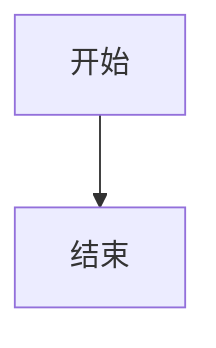
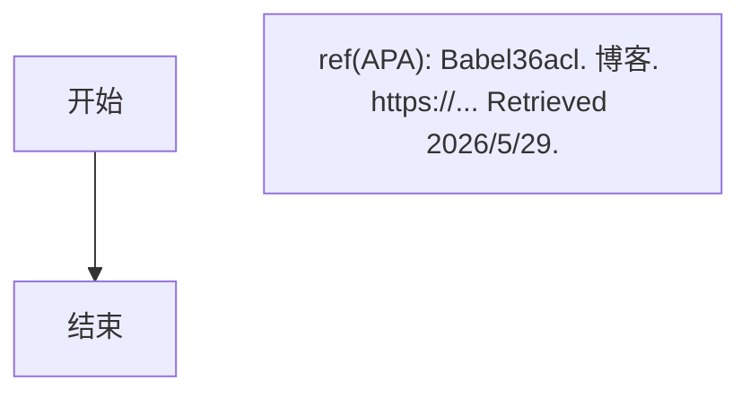

# Mermaid 代码块引用文本规范

## 问题

把 APA 引用/参考文献文本放在 ` ```mermaid ` 代码块内部：

```mermaid
flowchart TD
    A[开始] --> B[结束]
ref(APA): Babel36acl. ... Retrieved 2026/5/29.  ← 错误！Mermaid 会报 Syntax error
```

Mermaid 把 `ref(APA):` 当成图表语法解析，报：

```
Syntax error in text
mermaid version 11.15.0
```

## 正确做法

### 方案 1：引用放在 Mermaid 代码块外（推荐）

````markdown


ref(APA): Babel36acl. *博客名*. https://... Retrieved 2026/5/29.
````

### 方案 2：引用作为节点文本（如果一定要放图里）



## 注意事项

- Mermaid 只支持 `flowchart`/`stateDiagram`/`sequenceDiagram`/`graph` 等图表语法
- 普通文本、注释、引用在代码块内都会触发 Syntax error
- 引用永远放在代码块外部的 Markdown 段落中
- 插件 PHP filter 只处理 `<pre><code class="language-mermaid">`，外部引用不受影响
